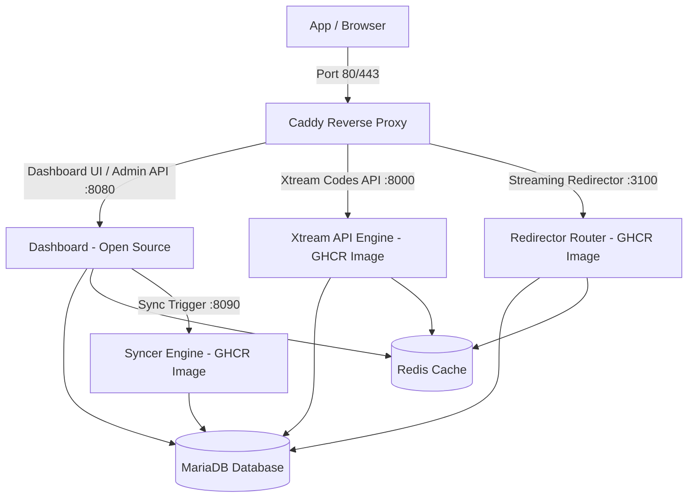

# User Management Panel & Gateway (Community Edition)

Open-source web dashboard and management panel designed for high performance, multi-user access control, automated synchronization, and Xtream Codes compatible streaming architectures.

> 📖 **Comprehensive Step-by-Step Guide**: For detailed instructions on installation, initial setup wizard, features walkthrough, recommended settings, and domain setup with Cloudflare & SSL, check [**docs/INSTALLATION_AND_USAGE_GUIDE.md**](docs/INSTALLATION_AND_USAGE_GUIDE.md).

---

## Architecture Overview

This project uses an **Open-Core** architecture:
- **Open Source (`web/`, `cmd/dashboard`, `internal/api`)**: Complete web dashboard UI (Vite SPA) and REST administration API.
- **Closed Source / Managed Engines (`xtream`, `redirector`, `syncer`)**: High-throughput Xtream Codes emulation API, ultra-fast streaming redirector, and background synchronization engine distributed as pre-compiled, hardened container images from [GitHub Container Registry](https://github.com/lkinderbueno?tab=packages).



---

## Quick Start (One-Line Installer)

On a clean Ubuntu/Debian server, update system packages and install Docker:
```bash
sudo apt update && sudo apt upgrade -y
curl -fsSL https://get.docker.com | sh
```

Then run the one-line panel installer:
```bash
curl -fsSL https://ump.playlistlabs.io/setup.sh | bash
```

The script guides you through:
1. Verifying Docker & Compose readiness (or installs Docker if missing).
2. Choosing your MariaDB user & root passwords (or pressing Enter for strong auto-generated passwords).
3. Selecting your HTTP port for Caddy (verifying port availability on your host; defaults domain to localhost and your server IP).
4. Selecting the application version to deploy (default: `latest`).
5. Pulling container images and booting up the entire platform safely behind Caddy.

Once started, open **`http://<your-server-ip>`** (or **`http://<your-server-ip>:<port>`** / **`https://<your-domain>`**) in your browser to complete the initial setup wizard. All traffic is securely routed through the Caddy gateway.

### Unattended & Automated Installation (CLI Arguments)

To deploy or upgrade automatically without interactive prompts (ideal for automated scripts, cloud-init, or CI/CD):

```bash
# 100% unattended installation with auto-generated secure credentials:
curl -fsSL https://ump.playlistlabs.io/setup.sh | bash -s -- -y

# Unattended with custom port, domain, and credentials:
curl -fsSL https://ump.playlistlabs.io/setup.sh | bash -s -- -p 8080 -d panel.example.com --db-pass "MySecretPass!" -y
```

Available arguments:
- `-p, --port <port>`: HTTP port for Caddy (default: `80`)
- `-d, --domain <domain>`: Primary domain or server IP (default: `localhost`)
- `-v, --version <tag>`: Application version (default: `latest`)
- `--db-pass <password>`: MariaDB user password
- `--db-root-pass <password>`: MariaDB root password
- `--dir <directory>`: Installation directory (default: `user-management-panel`)
- `-y, --yes, --non-interactive`: Run unattended without prompts
- `-h, --help`: Display help and options

---

## Manual Installation with Docker Compose

If you prefer installing manually:

### 1. Clone the repository
```bash
git clone https://github.com/lkinderbueno/user-management-panel.git
cd user-management-panel
```

### 2. Configure Environment Variables & Secrets
```bash
cp .env.example .env
mkdir -p secrets
openssl rand -base64 24 > secrets/db_password.txt
openssl rand -base64 24 > secrets/db_root_password.txt
openssl rand -base64 32 > secrets/jwt_secret.txt
```

Edit `.env` to configure your `HTTP_PORT` (default 80) and `DOMAIN` if needed.

### 3. Start the Platform
```bash
docker compose up -d
```

Open your browser and navigate to:
```
http://localhost (or http://localhost:<HTTP_PORT>)
```
On first launch, the **Initial Setup Wizard** will guide you to create the initial Administrator account.

### Password Reset & Account Recovery

If you lose your administrator password or get blocked by the anti-brute-force system:

```bash
# Direct execution inside the running dashboard container:
docker compose exec dashboard reset_password

# Or set a specific password:
docker compose exec dashboard reset_password -u admin -p "MyNewPassword123!"

# Or run via universal helper script:
./reset-password.sh
```

---

## Development & Building from Source

### Web Frontend (SPA)
```bash
cd web
npm install
npm run build
```

### Dashboard Go Server
```bash
go build -o dashboard ./cmd/dashboard
./dashboard
```

---

## Uninstallation & Complete Cleanup

To completely stop and remove the platform, including all persistent database volumes, secrets, downloaded images, and configuration:

```bash
# Complete uninstall & cleanup (with interactive confirmation):
./uninstall.sh

# Or via setup.sh:
./setup.sh --uninstall

# Unattended / non-interactive complete cleanup (zero prompts):
./uninstall.sh -y

# Or via curl one-liner without cloning:
curl -fsSL https://ump.playlistlabs.io/uninstall.sh | bash -s -- -y
```

> **Note**: To remove containers while preserving database data and credentials, use `--keep-volumes`:
> ```bash
> ./uninstall.sh --keep-volumes
> ```

---

## License

The Dashboard and management UI are released under the [MIT License](LICENSE).
The containerized streaming and syncer engines are proprietary software provided under the PlaylistLabs EULA.
